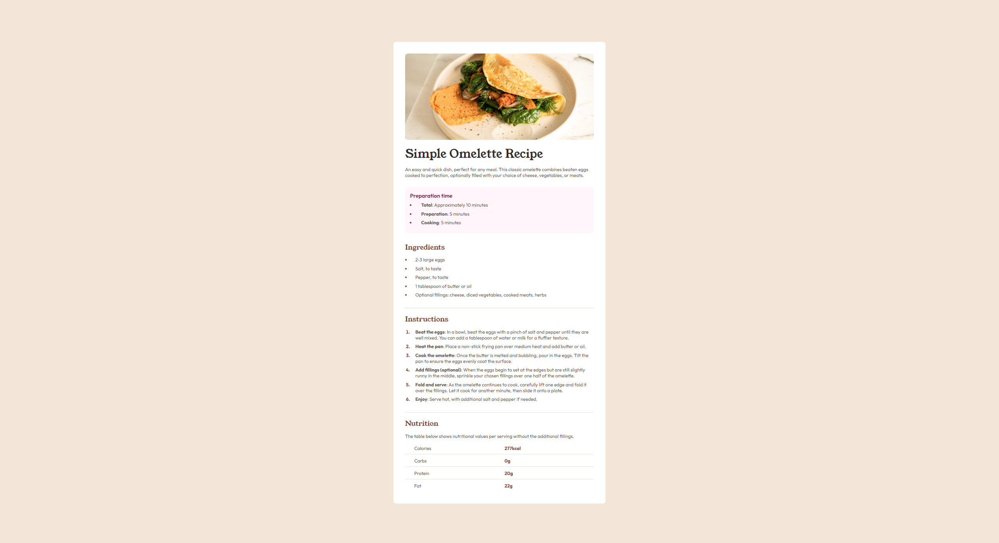

# Frontend Mentor - Recipe Page Solution

This is a solution to the [Recipe Page challenge on Frontend Mentor](https://www.frontendmentor.io/challenges).

## Table of Contents
- [Overview](#overview)
  - [The Challenge](#the-challenge)
  - [Screenshot](#screenshot)
  - [Links](#links)
  - [Built With](#built-with)
  - [What I Learned](#what-i-learned)
  - [Challenges](#challenges)
  - [Future Improvements](#future-improvements)
- [Author](#author)

### The Challenge

"This challenge will help you focus on writing semantic HTML. Ensure you think through what HTML elements are most appropriate for each piece of content."

### Screenshot

### Links
- Solution URL: [GitHub Repository](https://github.com/jayco01/recipe-page.git)
- Live Site URL: [Live Project](https://jayco01.github.io/recipe-page/)

### Built With

- Semantic HTML5 markup
- CSS BEM methodology
- Flexbox for layout and positioning
- Google Fonts for typography

### What I Learned

During this project, I focused on improving my code structure for better readability and maintainability using the BEM methodology. I also learned:
- How to use `li::marker` to change bullet colors.
- How `:last-child` can remove a border from the last row of a table.
- How to properly style tables and lists for better presentation.

### Challenges

One of the biggest challenges I faced was aligning lists and styling tables. This was my first time working with those elements in-depth, and it required extensive research to understand how to:
- Ensure list bullets aligned correctly and did not break indentation when wrapping to a second line.
- Make table columns evenly spaced and prevent text from overflowing.

### Future Improvements

- Table Styling: I want to gain a deeper understanding of table styling properties, especially when it comes to spacing and aligning content within each cell.
- List Customization: Styling lists can be tricky, and I’d like to explore more ways to control spacing, bullet design, and indentation.

## Author

- GitHub - [Jay Vincent Layco](https://github.com/jayco01)

### Thank You!
If you have any feedback or suggestions for improvement, feel free to reach out!

